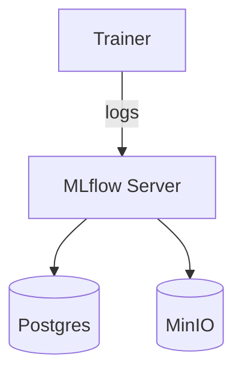

# MLflow Study (with Optuna)

A hands-on repository to learn **MLflow** step by step and finish with **hyperparameter tuning using Optuna**.
It ships a ready-to-run **Docker Compose file** (MLflow Server + Postgres + MinIO + trainer) so you can experiment locally.

## Goals

* Understand MLflow’s four pillars: **Tracking / Models / Registry / Serving**
* Standardize experiment logging (Params / Metrics / Artifacts) and comparisons
* Package models with **signature**, **input example**, and **dependencies**
* Run **Optuna** studies and **log each trial** into MLflow automatically

## Stack & Architecture



* **MLflow Server**: central tracking server & UI (`http://localhost:5000`)
* **Postgres**: experiment/run **metadata** (backend store)
* **MinIO**: **artifacts** (models, plots, reports) – S3-compatible
* **trainer**: container to execute your scripts with MLflow client preconfigured

## Repository Structure

```
MLflow-study/
├─ docker-compose.yml
├─ Dockerfile
├─ requirements.txt
├─ .env.example
├─ .gitignore
├─ README.md
├─ src/
│  ├─ path.py
│  ├─ utils.py
│  └─ mlflow_utils.py  # shared MLflow helpers (e.g., set experiment)
└─ tutorial/         # all hands-on modules live here
   ├─ 01_tracking_basics/
   ├─ 02_artifacts/
   ├─ 03_models_pyfunc/
   ├─ 04_registry/
   ├─ 05_serving/
   ├─ 06_autolog/
   └─ 07_optuna_tuning/
```

## Quickstart

### 0) Prereqs

* Docker & Docker Compose installed

### 1) (Optional) Configure environment

```bash
cp .env.example .env
# edit values if needed (DB/MINIO credentials, bucket name, etc.)
```

### 2) Launch the stack

```bash
docker compose up -d --build
```

Open:

* **MLflow UI** → [http://localhost:5000](http://localhost:5000)
* **MinIO Console** → [http://localhost:9001](http://localhost:9001)  (default: `minioadmin` / `minioadmin`)

### 3) Run the first example

```bash
docker compose exec trainer bash
python tutorial/01_tracking_basics/run.py
```

Then visit the UI and check the **`01-tracking-basics`** experiment for params, step-wise metrics, artifacts, and tags.

## Examples Index

| Folder                                  | Topic            | What you’ll practice                            |
| --------------------------------------- | ---------------- | ----------------------------------------------- |
| `examples/01_tracking_basics`           | Tracking basics  | Params / Metrics (with step) / Artifacts / Tags |
| `examples/02_artifacts`                 | Artifact logging | Images, text files, and `log_table`             |
| `examples/03_models_pyfunc`             | Model packaging  | `signature`, `input_example`, and dependencies  |
| `examples/04_registry`                  | Model Registry   | Register versions, promote/rollback stages      |
| `examples/05_serving`                   | Local serving    | Serve `models:/NAME/Production` via REST        |
| `examples/06_autolog`                   | Autologging      | One-liner logging for sklearn/xgboost/etc.      |
| `examples/07_optuna_tuning`             | Optuna study     | Parent run + child (trial) runs, best model     |

Each example has its own `README.md` with commands and expected UI views.

## Versions

* Python **3.11**
* `mlflow >= 2.12.1` (2.12.0 was yanked; use 2.12.1+)
* See `requirements.txt` for Optuna/XGBoost/scikit-learn pins


